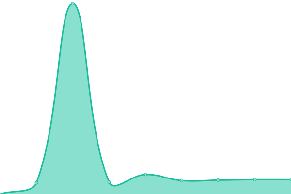
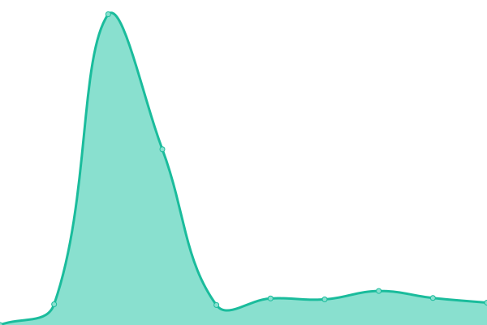

# [📈 Live Status](https://demo.upptime.js.org): <!--live status--> **🟩 All systems operational**

This repository contains the open-source uptime monitor and status page for [equipotiosf](https://demo.upptime.js.org), powered by [Upptime](https://github.com/upptime/upptime).

With [Upptime](https://upptime.js.org), you can get your own unlimited and free uptime monitor and status page, powered entirely by a GitHub repository. We use [Issues](https://github.com/equipotiosf/upptime/issues) as incident reports, [Actions](https://github.com/equipotiosf/upptime/actions) as uptime monitors, and [Pages](https://demo.upptime.js.org) for the status page.

<!--start: status pages-->
<!-- This summary is generated by Upptime (https://github.com/upptime/upptime) -->
<!-- Do not edit this manually, your changes will be overwritten -->
<!-- prettier-ignore -->
| URL | Status | History | Response Time | Uptime |
| --- | ------ | ------- | ------------- | ------ |
|  [Api-Spring](https://api.osf.pe/swagger-ui.html) | 🟩 Up | [api-spring.yml](https://github.com/equipotiosf/monitor/commits/HEAD/history/api-spring.yml) | 

 623ms
     
 | 

<a href="https://equipotiosf.github.io/monitor/history/api-spring">100.00%</a>
    

|  [A1delivery](https://a1pedidos.pe) | 🟩 Up | [a1delivery.yml](https://github.com/equipotiosf/monitor/commits/HEAD/history/a1delivery.yml) | 

 746ms
     
 | 

<a href="https://equipotiosf.github.io/monitor/history/a1delivery">91.77%</a>
    

|  [WebSite-Osf](https://osf.pe) | 🟩 Up | [web-site-osf.yml](https://github.com/equipotiosf/monitor/commits/HEAD/history/web-site-osf.yml) | 

 717ms
     
 | 

<a href="https://equipotiosf.github.io/monitor/history/web-site-osf">99.65%</a>
    

|  [WebSite-Bluefish](https://apps.bluefishtrading.com) | 🟩 Up | [web-site-bluefish.yml](https://github.com/equipotiosf/monitor/commits/HEAD/history/web-site-bluefish.yml) | 

 546ms
     
 | 

<a href="https://equipotiosf.github.io/monitor/history/web-site-bluefish">100.00%</a>
    

|  [App Glassfish](https://apps.osf.pe) | 🟩 Up | [app-glassfish.yml](https://github.com/equipotiosf/monitor/commits/HEAD/history/app-glassfish.yml) | 

 590ms
     
 | 

<a href="https://equipotiosf.github.io/monitor/history/app-glassfish">99.65%</a>
    

<!--end: status pages-->

[**Visit our status website →**](https://demo.upptime.js.org)

## 📄 License

- Powered by: [Upptime](https://github.com/upptime/upptime)
- Code: [MIT](./LICENSE) © [equipotiosf](https://demo.upptime.js.org)
- Data in the `./history` directory: [Open Database License](https://opendatacommons.org/licenses/odbl/1-0/)
